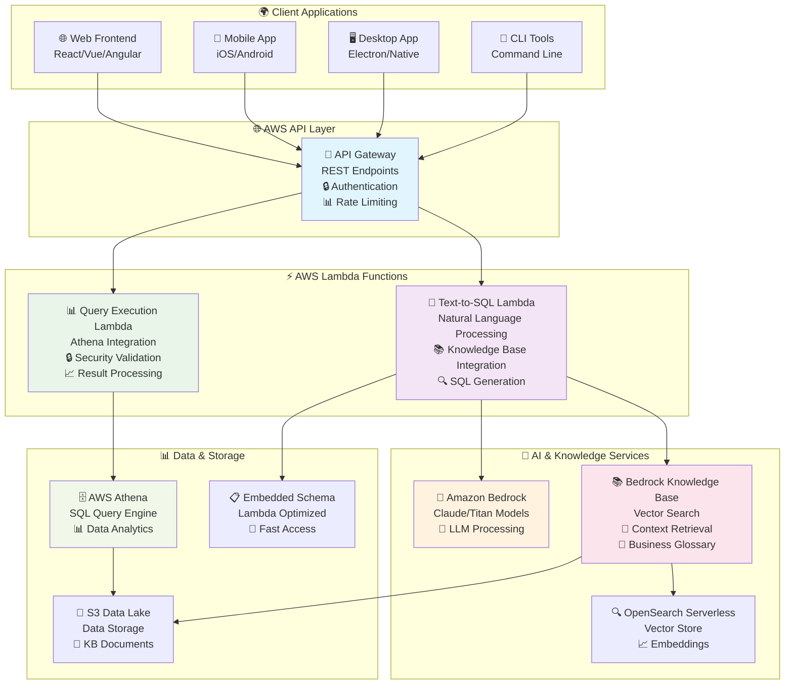
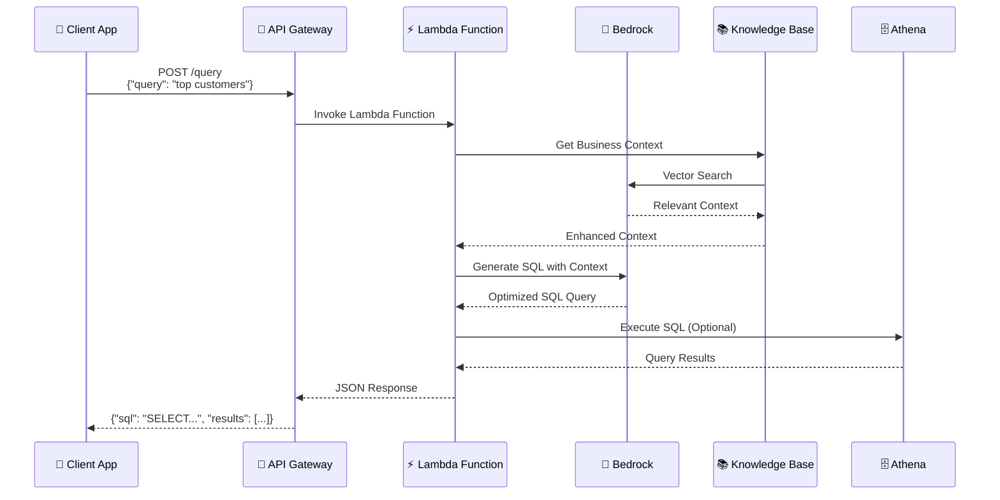

# 🤖 Text-to-SQL AI Agent
### Enterprise-Grade Natural Language to SQL with AWS Serverless Architecture

[](https://python.org)
[](https://aws.amazon.com)
[](https://aws.amazon.com/lambda/)
[](https://aws.amazon.com/api-gateway/)
[](LICENSE)

> **🚀 Production-Ready Serverless AI Agent** built on AWS Lambda and API Gateway. Features advanced Knowledge Base integration, serverless architecture, and REST API endpoints for natural language to SQL conversion.

---

## 🌟 **Key Features at a Glance**

| Feature | Description | Status |
|---------|-------------|--------|
| 🚀 **Serverless Architecture** | AWS Lambda + API Gateway for scalable deployment | ✅ Production Ready |
| 🌐 **REST API Endpoints** | RESTful API for natural language to SQL conversion | ✅ Production Ready |
| 🧠 **Advanced Knowledge Base** | AI-enhanced queries with business context | ✅ Production Ready |
| 🔐 **Enterprise Security** | IAM roles, API authentication, SQL injection protection | ✅ Production Ready |
| ⚡ **Auto-scaling** | Serverless functions with automatic scaling | ✅ Production Ready |
| 📊 **Embedded Schema** | Optimized schema embedded in Lambda functions | ✅ Production Ready |
| 🛠️ **Automated Deployment** | One-click Lambda deployment scripts | ✅ Production Ready |
| 📚 **Comprehensive API Docs** | Complete API documentation and examples | ✅ Production Ready |

---

## 🚀 **Quick Start - Serverless API Deployment**

### **Step 1: 📋 Prerequisites**
```bash
# Install AWS CLI and configure credentials
aws configure

# Verify Bedrock access
aws bedrock list-foundation-models --region us-east-1
```

### **Step 2: ⚡ Deploy Lambda Function**
```bash
# Clone repository
git clone https://github.com/ashokkumar261261/text-to-sql-agent.git
cd text-to-sql-agent

# Windows deployment
deploy_lambda.bat your-function-name

# PowerShell deployment
.\deploy_lambda.ps1 -FunctionName "your-function-name"
```

### **Step 3: 🌐 Setup API Gateway**
```bash
# Create API Gateway (manual setup required)
# 1. Go to AWS API Gateway Console
# 2. Create new REST API
# 3. Create resource and POST method
# 4. Integrate with your Lambda function
# 5. Deploy API to get public endpoint
```

### **Step 4: 🧪 Test API Endpoint**
```bash
# Test with curl
curl -X POST https://your-api-id.execute-api.us-east-1.amazonaws.com/prod/query \
  -H "Content-Type: application/json" \
  -d '{"query": "Show me top 5 customers by revenue"}'

# Test with AWS CLI
aws lambda invoke --function-name your-function-name --payload file://test_payload.json response.json
```

---

## 🎯 **Core Capabilities**

### 🤖 **AI-Powered SQL Generation**
- **Natural Language Processing** - Convert plain English to SQL via REST API
- **Context Awareness** - Understands business terminology and relationships
- **Query Optimization** - Generates efficient, validated SQL queries
- **Multi-Model Support** - Amazon Bedrock (Claude, Titan, Llama)

### 🌐 **REST API Interface**
- **RESTful Endpoints** - Standard HTTP methods for integration
- **JSON Request/Response** - Structured data exchange
- **API Authentication** - Secure access control via API Gateway
- **Rate Limiting** - Built-in request throttling and quotas
- **Error Handling** - Comprehensive error responses and status codes

### 🧠 **Knowledge Base Integration**
- **Business Context** - Domain-specific terminology and rules
- **Vector Search** - AI-powered context retrieval
- **Intent Analysis** - Understands query complexity and requirements
- **Business Rules** - Automated compliance validation

### 🔐 **Enterprise Security**
- **API Gateway Security** - Built-in authentication and authorization
- **SQL Injection Protection** - Advanced query validation
- **IAM Integration** - AWS role-based access control
- **Audit Trail** - Complete API request logging

---

## 🌐 **API Endpoints & Usage**

### **📋 API Specification**

#### **POST /query** - Generate SQL from Natural Language
```bash
# Request
curl -X POST https://your-api-gateway-url/prod/query \
  -H "Content-Type: application/json" \
  -d '{
    "query": "Show me top 5 customers by revenue",
    "execute": true,
    "explain": false
  }'

# Response
{
  "sql_query": "SELECT name, SUM(total_amount) as revenue FROM customers c JOIN orders o ON c.customer_id = o.customer_id GROUP BY c.customer_id, name ORDER BY revenue DESC LIMIT 5",
  "results": [
    {"name": "John Smith", "revenue": 15420.50},
    {"name": "Jane Doe", "revenue": 12350.75}
  ],
  "row_count": 5,
  "execution_time": 1.2,
  "status": "success"
}
```

#### **POST /validate** - Validate SQL Query
```bash
# Request
curl -X POST https://your-api-gateway-url/prod/validate \
  -H "Content-Type: application/json" \
  -d '{
    "sql": "SELECT * FROM customers WHERE customer_id = 1"
  }'

# Response
{
  "valid": true,
  "issues": [],
  "suggestions": ["Consider adding LIMIT clause for better performance"],
  "status": "success"
}
```

#### **GET /schema** - Get Database Schema
```bash
# Request
curl -X GET https://your-api-gateway-url/prod/schema

# Response
{
  "tables": [
    {
      "name": "customers",
      "columns": [
        {"name": "customer_id", "type": "BIGINT", "primary_key": true},
        {"name": "name", "type": "STRING", "nullable": false}
      ]
    }
  ],
  "status": "success"
}
```

---

## 🏗️ **Serverless Architecture Overview**

### **🌐 AWS Serverless Architecture**



### **🔄 API Request Flow**



---

## 📋 **Example Queries & Use Cases**

### **� B usiness Analytics**
```sql
-- Natural Language: "Show me monthly revenue trends"
SELECT 
    DATE_TRUNC('month', order_date) as month,
    SUM(total_amount) as revenue
FROM orders 
GROUP BY month 
ORDER BY month;
```

### **🎯 Customer Insights**
```sql
-- Natural Language: "Find high-value customers in Texas"
SELECT 
    c.name, 
    c.state,
    SUM(o.total_amount) as lifetime_value
FROM customers c
JOIN orders o ON c.customer_id = o.customer_id
WHERE c.state = 'Texas'
GROUP BY c.customer_id, c.name, c.state
HAVING lifetime_value > 1000
ORDER BY lifetime_value DESC;
```

### **📈 Product Performance**
```sql
-- Natural Language: "What are the top selling products by category?"
SELECT 
    p.category,
    p.name,
    COUNT(o.order_id) as order_count,
    SUM(o.quantity) as total_sold
FROM products p
JOIN orders o ON p.product_id = o.product_id
GROUP BY p.category, p.name
ORDER BY total_sold DESC;
```

---

## ⚡ **Performance & Scalability**

| Metric | Performance | Details |
|--------|-------------|---------|
| **API Response Time** | < 2 seconds | AI-powered SQL generation via Lambda |
| **Cold Start** | < 1 second | Optimized Lambda function with embedded schema |
| **Concurrent Requests** | 1000+ | API Gateway + Lambda auto-scaling |
| **Query Execution** | Athena speed | Depends on data size and complexity |
| **Data Volume** | Petabyte scale | AWS Athena capabilities |
| **Cost Efficiency** | Pay-per-request | Serverless pricing model |

---

## 🛠️ **Setup & Configuration**

### **Prerequisites**
- Python 3.9+
- AWS Account with Bedrock, Lambda, API Gateway access
- AWS CLI configured (`aws configure`)

### **🔧 Environment Setup**
```bash
# 1. Clone repository
git clone https://github.com/ashokkumar261261/text-to-sql-agent.git
cd text-to-sql-agent

# 2. Configure AWS credentials
aws configure

# 3. Set environment variables (for Lambda)
# Edit lambda_function.py with your AWS settings

# 4. Optional: Setup Knowledge Base
python create_clean_kb.py
```

### **📋 Configuration Files**
- `lambda_function.py` - Main serverless function code
- `.env` - AWS credentials and settings (for local testing)
- `.env.kb` - Knowledge Base configuration  
- Multiple KB document sets in `kb_documents_*` folders
- `test_payload.json` - Sample API requests for testing

### **🚀 Automated Deployment Scripts**

| Script | Purpose | Platform |
|--------|---------|----------|
| `deploy_lambda.bat` | Deploy to AWS Lambda | Windows |
| `deploy_lambda.ps1` | Deploy to AWS Lambda | PowerShell |
| `create_clean_kb.bat` | Setup Knowledge Base | Windows |
| `create_kb.ps1` | Setup Knowledge Base | PowerShell |
| `fix_permissions.bat` | Fix IAM permissions | Windows |
| `update_lambda_with_embedded_schema.py` | Update Lambda with schema | Python |

---

## 📚 **Documentation & Guides**

| Guide | Description | Link |
|-------|-------------|------|
| **🚀 AWS Deployment** | Complete AWS deployment guide | [DEPLOY_TO_AWS.md](DEPLOY_TO_AWS.md) |
| **📋 Setup Instructions** | Step-by-step setup guide | [FINAL_SETUP_INSTRUCTIONS.md](FINAL_SETUP_INSTRUCTIONS.md) |
| **🧠 Knowledge Base** | KB creation and configuration | [COMPLETE_KB_CREATION_GUIDE.md](COMPLETE_KB_CREATION_GUIDE.md) |
| **🔐 IAM Permissions** | AWS security configuration | [IAM_USER_LOGIN_INSTRUCTIONS.md](IAM_USER_LOGIN_INSTRUCTIONS.md) |
| **💳 Bedrock Setup** | Bedrock access and billing | [BEDROCK_PAYMENT_SETUP.md](BEDROCK_PAYMENT_SETUP.md) |
| **🪟 Windows Setup** | Windows-specific instructions | [WINDOWS_SETUP.md](WINDOWS_SETUP.md) |
| **📊 Sample Data** | Test data setup guide | [SAMPLE_DATA_GUIDE.md](SAMPLE_DATA_GUIDE.md) |
| **⚡ Quick Start** | Fast setup guide | [QUICKSTART.md](QUICKSTART.md) |

---

## 🚀 **Deployment & Integration**

### **☁️ AWS Lambda Deployment**
```bash
# Deploy Lambda function
deploy_lambda.bat TextToSQLFunction

# Update function code
aws lambda update-function-code \
  --function-name TextToSQLFunction \
  --zip-file fileb://lambda_deployment.zip
```

### **🌐 API Gateway Integration**
```bash
# Create REST API
aws apigateway create-rest-api --name "TextToSQLAPI"

# Create resource and method
# Link to Lambda function
# Deploy to stage (prod/dev)
```

### **🔧 Client Integration Examples**

#### **JavaScript/Node.js**
```javascript
const axios = require('axios');

const response = await axios.post('https://your-api-url/prod/query', {
  query: "Show me top 5 customers by revenue",
  execute: true
});

console.log(response.data.sql_query);
console.log(response.data.results);
```

#### **Python**
```python
import requests

response = requests.post('https://your-api-url/prod/query', json={
    'query': 'Show me top 5 customers by revenue',
    'execute': True
})

data = response.json()
print(data['sql_query'])
print(data['results'])
```

#### **cURL**
```bash
curl -X POST https://your-api-url/prod/query \
  -H "Content-Type: application/json" \
  -d '{"query": "Show me top 5 customers by revenue", "execute": true}'
```

---

## � **Security & Compliance**

### **🛡️ Security Features**
- ✅ **API Gateway Authentication** - IAM, API Keys, or Cognito
- ✅ **SQL Injection Protection** - Advanced input validation
- ✅ **Read-Only Operations** - Prevents data modification
- ✅ **IAM Role-Based Access** - Fine-grained permissions
- ✅ **CloudWatch Logging** - Complete audit trail

### **📋 Compliance**
- **Data Privacy** - No data stored in Lambda (stateless)
- **Access Control** - IAM-based permissions
- **Query Validation** - Prevents dangerous operations
- **Encryption** - All data in transit encrypted (HTTPS)

---

## 📁 **Project Structure**

```
text-to-sql-agent/
├── ⚡ Lambda Functions
│   ├── lambda_function.py          # 🚀 Main Lambda handler
│   ├── lambda_function_fallback.py # 🔄 Fallback handler
│   ├── lambda_deployment.zip       # 📦 Deployment package
│   └── lambda/
│       └── handler.py              # 🎯 Alternative handler
│
├── 🧠 Core Intelligence
│   └── src/
│       ├── agent.py                # 🤖 AI agent logic
│       ├── knowledge_base.py       # 📚 Knowledge base manager
│       ├── query_validator.py      # 🔒 Security & validation
│       ├── database.py             # 🗄️ Athena integration
│       └── schema.py               # 📋 Schema management
│
├── 📚 Knowledge Base Documents
│   ├── kb_documents_final/         # 🎯 Production KB docs
│   │   ├── business_glossary.md
│   │   ├── database_schema.md
│   │   └── sql_examples.md
│   ├── kb_documents/               # 📝 Standard KB docs
│   ├── kb_flexible/                # 🔄 Flexible KB docs
│   └── kb_focused/                 # 🎯 Focused KB docs
│
├── 🔧 Setup & Configuration
│   ├── create_clean_kb.py          # 🚀 KB setup automation
│   ├── create_kb_role.py           # 👤 IAM role creation
│   ├── create_kb_with_iam.py       # 🔐 KB + IAM setup
│   ├── update_lambda_with_embedded_schema.py # 📋 Schema embedding
│   └── Various config JSON files
│
├── 📖 Documentation
│   ├── README.md                   # 📋 Main documentation
│   ├── DEPLOY_TO_AWS.md            # 🚀 Deployment guide
│   ├── FINAL_SETUP_INSTRUCTIONS.md # 📋 Setup guide
│   ├── COMPLETE_KB_CREATION_GUIDE.md # 🧠 KB guide
│   ├── BEDROCK_PAYMENT_SETUP.md    # 💳 Billing setup
│   ├── IAM_USER_LOGIN_INSTRUCTIONS.md # 🔐 IAM guide
│   └── WINDOWS_SETUP.md            # 🪟 Windows guide
│
├── 🧪 Testing & Examples
│   ├── test_bedrock_access.py      # 🧪 Bedrock tests
│   ├── test_role_access.py         # 🔐 IAM tests
│   ├── test_system.py              # 🧪 System tests
│   ├── test_payload.json           # 📋 Test payloads
│   └── Various test files
│
├── 🚀 Deployment Scripts
│   ├── deploy_lambda.bat           # 🪟 Windows deployment
│   ├── deploy_lambda.ps1           # � PowherShell deployment
│   ├── create_clean_kb.bat         # 🪟 KB setup (Windows)
│   ├── create_kb.ps1               # 💻 KB setup (PowerShell)
│   └── fix_permissions.bat         # 🔧 Permission fixes
│
└── ⚙️ Configuration Files
    ├── .env.example                # 🔧 Environment template
    ├── .env.kb                     # 📚 KB configuration
    ├── requirements.txt            # � Pythoan dependencies
    └── Various policy JSON files
```

---

## 🤝 **Contributing & Support**

### **🔧 Development**
```bash
# Setup development environment
git clone https://github.com/ashokkumar261261/text-to-sql-agent.git
cd text-to-sql-agent

# Install dependencies
pip install -r requirements.txt

# Run local tests
python test_system.py
```

### **📝 Contributing**
1. Fork the repository
2. Create feature branch (`git checkout -b feature/amazing-feature`)
3. Commit changes (`git commit -m 'Add amazing feature'`)
4. Push to branch (`git push origin feature/amazing-feature`)
5. Open Pull Request

### **🆘 Support**
- **Issues**: [GitHub Issues](https://github.com/ashokkumar261261/text-to-sql-agent/issues)
- **Discussions**: [GitHub Discussions](https://github.com/ashokkumar261261/text-to-sql-agent/discussions)
- **Documentation**: See guides above

---

## 📊 **Project Stats**

| Metric | Value |
|--------|-------|
| **Lines of Code** | 2,000+ (Lambda optimized) |
| **Features** | 20+ core features |
| **Documentation** | 10+ comprehensive guides |
| **AWS Services** | 6+ integrated services |
| **Deployment Scripts** | 10+ automation scripts |

---

## 📄 **License**

This project is licensed under the MIT License - see the [LICENSE](LICENSE) file for details.

---

## 🌟 **Star the Project**

If you find this project useful, please consider giving it a star! ⭐

[](https://github.com/ashokkumar261261/text-to-sql-agent)

---

<div align="center">

**🚀 Built with ❤️ using AWS Lambda, API Gateway, Bedrock, and Athena**

[Get Started](#-quick-start---serverless-api-deployment) • [View Demo](https://github.com/ashokkumar261261/text-to-sql-agent) • [Documentation](#-documentation--guides)

</div>