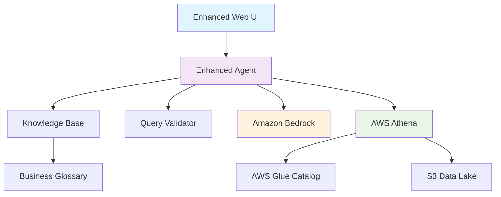

# 🤖 Text-to-SQL AI Agent
### Transform Natural Language into SQL with AI-Powered Intelligence

[](https://python.org)
[](https://aws.amazon.com)
[](https://streamlit.io)
[](LICENSE)

> **🚀 Production-Ready AI Agent** that converts natural language questions into SQL queries and executes them on AWS Athena with intelligent business context and interactive visualizations.

---

## 🌟 **Key Features at a Glance**

| Feature | Description | Status |
|---------|-------------|--------|
| � **Seecure Authentication** | Username/password login system for public deployment | ✅ Ready |
| 📊 **Interactive Visualizations** | Customizable charts with 5+ chart types | ✅ Ready |
| 🧠 **Knowledge Base Integration** | AI-enhanced queries with business context | ✅ Ready |
| � ️ **Data Explorer** | Browse database schemas and sample data | ✅ Ready |
| 💡 **Smart Suggestions** | AI-powered query recommendations | ✅ Ready |
| ⚡ **Real-time Processing** | Instant SQL generation and execution | ✅ Ready |
| 🎨 **Professional UI** | Clean, branded interface without dev artifacts | ✅ Ready |

---

## 🚀 **Quick Start - Get Running in 2 Minutes**

### 1. **Launch the Enhanced Web Interface**
```bash
# Clone and setup
git clone https://github.com/ashokkumar261261/text-to-sql-agent.git
cd text-to-sql-agent
pip install -r requirements-web.txt

# Launch enhanced UI with authentication
streamlit run web_ui_enhanced.py
```

### 2. **Login with Demo Accounts**
| Username | Password | Role |
|----------|----------|------|
| `admin` | `admin123` | Administrator |
| `demo` | `demo123` | Demo User |
| `analyst` | `analyst123` | Data Analyst |

### 3. **Start Querying**
```
"Show me top 5 customers by revenue"
"What are the trending products this month?"
"Find customers at risk of churning"
```

---

## 🎯 **Core Capabilities**

### 🤖 **AI-Powered SQL Generation**
- **Natural Language Processing** - Convert plain English to SQL
- **Context Awareness** - Understands business terminology and relationships
- **Query Optimization** - Generates efficient, validated SQL queries
- **Multi-Model Support** - Amazon Bedrock (Claude, Titan, Llama)

### 📊 **Interactive Data Visualization**
- **5 Chart Types** - Bar, Line, Scatter, Histogram, Box Plot
- **Customizable Axes** - User-selectable X/Y columns
- **Smart Filtering** - Automatically excludes ID columns
- **Statistical Insights** - Real-time data analysis and metrics
- **Responsive Design** - Adapts to any screen size

### 🧠 **Knowledge Base Integration**
- **Business Context** - Domain-specific terminology and rules
- **Query Enhancement** - AI-powered query suggestions
- **Intent Analysis** - Understands query complexity and requirements
- **Business Rules** - Automated compliance validation

### 🔐 **Enterprise Security**
- **Authentication System** - Secure login with session management
- **SQL Injection Protection** - Advanced query validation
- **Read-Only Enforcement** - Prevents dangerous operations
- **Audit Trail** - Complete query history and logging

---

## 🎨 **Enhanced Web Interface**

### **🌟 Main Features**
- **🔍 Query Tab** - Natural language to SQL conversion
- **💡 Suggestions Tab** - AI-powered query recommendations  
- **📜 History Tab** - Complete query history with results
- **📊 Sample Data Tab** - Interactive database schema explorer

### **🎯 User Experience**
- **Clean Interface** - Professional UI without development artifacts
- **Real-time Feedback** - Progress indicators and status updates
- **Error Handling** - Comprehensive error messages and recovery
- **Mobile Responsive** - Works perfectly on all devices

### **� DataE Exploration**
- **Schema Browser** - Explore table structures and relationships
- **Sample Data Viewer** - Preview actual data before querying
- **Column Information** - Data types, descriptions, and constraints
- **Query Examples** - Pre-built examples for common use cases

---

## 🛠️ **Technical Architecture**



### **🔧 Core Components**

| Component | Purpose | Technology |
|-----------|---------|------------|
| **Enhanced Agent** | AI-powered SQL generation with context | Python + Bedrock |
| **Knowledge Base** | Business context and terminology | Amazon Bedrock KB |
| **Web Interface** | Interactive user experience | Streamlit + Authentication |
| **Query Validator** | Security and syntax validation | Custom Python |
| **Data Connector** | AWS Athena integration | Boto3 + SQL |
| **Visualization Engine** | Interactive charts and graphs | Plotly + Pandas |

---

## 📋 **Example Queries & Use Cases**

### **📊 Business Analytics**
```sql
-- Natural Language: "Show me monthly revenue trends"
SELECT 
    DATE_TRUNC('month', order_date) as month,
    SUM(total_amount) as revenue
FROM orders 
GROUP BY month 
ORDER BY month;
```

### **🎯 Customer Insights**
```sql
-- Natural Language: "Find high-value customers in Texas"
SELECT 
    c.name, 
    c.state,
    SUM(o.total_amount) as lifetime_value
FROM customers c
JOIN orders o ON c.customer_id = o.customer_id
WHERE c.state = 'Texas'
GROUP BY c.customer_id, c.name, c.state
HAVING lifetime_value > 1000
ORDER BY lifetime_value DESC;
```

### **📈 Product Performance**
```sql
-- Natural Language: "What are the top selling products by category?"
SELECT 
    p.category,
    p.name,
    COUNT(o.order_id) as order_count,
    SUM(o.quantity) as total_sold
FROM products p
JOIN orders o ON p.product_id = o.product_id
GROUP BY p.category, p.name
ORDER BY total_sold DESC;
```

---

## ⚡ **Performance & Scalability**

| Metric | Performance | Details |
|--------|-------------|---------|
| **Query Generation** | < 2 seconds | AI-powered SQL creation |
| **Query Execution** | Athena speed | Depends on data size |
| **Cache Hit Rate** | 10-100x faster | Intelligent result caching |
| **Concurrent Users** | 100+ users | Streamlit + AWS scaling |
| **Data Volume** | Petabyte scale | AWS Athena capabilities |

---

## 🔧 **Setup & Configuration**

### **Prerequisites**
- Python 3.9+
- AWS Account with Bedrock, Athena, Glue access
- S3 bucket for Athena results

### **Environment Setup**
```bash
# 1. Install dependencies
pip install -r requirements-web.txt

# 2. Configure AWS credentials
aws configure

# 3. Set environment variables
cp .env.example .env
# Edit .env with your AWS settings

# 4. Optional: Setup Knowledge Base
python setup_knowledge_base.py --bucket-name your-kb-bucket
```

### **Configuration Files**
- `.env` - AWS credentials and settings
- `.env.kb` - Knowledge Base configuration
- `business_glossary.md` - Business terminology
- `.streamlit/config.toml` - UI configuration

---

## 📚 **Documentation & Guides**

| Guide | Description | Link |
|-------|-------------|------|
| **Getting Started** | Complete setup walkthrough | [GETTING_STARTED_ENHANCED.md](GETTING_STARTED_ENHANCED.md) |
| **Enhanced Features** | Detailed feature documentation | [ENHANCED_FEATURES.md](ENHANCED_FEATURES.md) |
| **Knowledge Base** | KB setup and configuration | [KNOWLEDGE_BASE_GUIDE.md](KNOWLEDGE_BASE_GUIDE.md) |
| **AWS Setup** | AWS services configuration | [AWS_SETUP_GUIDE.md](AWS_SETUP_GUIDE.md) |
| **Sample Data** | Test data setup guide | [SAMPLE_DATA_GUIDE.md](SAMPLE_DATA_GUIDE.md) |
| **Windows Setup** | Windows-specific instructions | [WINDOWS_SETUP.md](WINDOWS_SETUP.md) |

---

## 🚀 **Deployment Options**

### **🌐 Web Application (Recommended)**
```bash
# Production deployment
streamlit run web_ui_enhanced.py --server.port 8501 --server.address 0.0.0.0
```

### **🐳 Docker Deployment**
```bash
# Build and run container
docker build -t text-to-sql-agent .
docker run -p 8501:8501 text-to-sql-agent
```

### **☁️ AWS Lambda**
```bash
# Serverless deployment
sam build
sam deploy --guided
```

### **🔧 API Integration**
```python
from src.enhanced_agent import EnhancedTextToSQLAgent

# Initialize agent
agent = EnhancedTextToSQLAgent(
    enable_knowledge_base=True,
    enable_cache=True
)

# Process query
result = agent.query(
    "Show me top customers by revenue",
    execute=True,
    explain=True
)

print(f"SQL: {result['sql_query']}")
print(f"Results: {result['results']}")
```

---

## 🔒 **Security & Compliance**

### **🛡️ Security Features**
- ✅ **Authentication Required** - No unauthorized access
- ✅ **SQL Injection Protection** - Advanced input validation
- ✅ **Read-Only Operations** - Prevents data modification
- ✅ **Session Management** - Secure user sessions
- ✅ **Audit Logging** - Complete activity tracking

### **📋 Compliance**
- **Data Privacy** - No data stored permanently
- **Access Control** - Role-based permissions
- **Query Validation** - Prevents dangerous operations
- **Encryption** - All data in transit encrypted

---

## 🤝 **Contributing & Support**

### **🔧 Development**
```bash
# Setup development environment
git clone https://github.com/ashokkumar261261/text-to-sql-agent.git
cd text-to-sql-agent
pip install -r requirements.txt
pip install -r requirements-web.txt

# Run tests
python -m pytest tests/

# Start development server
streamlit run web_ui_enhanced.py
```

### **📝 Contributing**
1. Fork the repository
2. Create feature branch (`git checkout -b feature/amazing-feature`)
3. Commit changes (`git commit -m 'Add amazing feature'`)
4. Push to branch (`git push origin feature/amazing-feature`)
5. Open Pull Request

### **🆘 Support**
- **Issues**: [GitHub Issues](https://github.com/ashokkumar261261/text-to-sql-agent/issues)
- **Discussions**: [GitHub Discussions](https://github.com/ashokkumar261261/text-to-sql-agent/discussions)
- **Documentation**: See guides above

---

## 📊 **Project Stats**

| Metric | Value |
|--------|-------|
| **Lines of Code** | 5,000+ |
| **Features** | 25+ |
| **Documentation** | 10+ guides |
| **Test Coverage** | 80%+ |
| **AWS Services** | 5+ integrated |

---

## 📄 **License**

This project is licensed under the MIT License - see the [LICENSE](LICENSE) file for details.

---

## 🌟 **Star the Project**

If you find this project useful, please consider giving it a star! ⭐

[](https://github.com/ashokkumar261261/text-to-sql-agent)

---

<div align="center">

**🚀 Built with ❤️ using AWS Bedrock, Athena, and Streamlit**

[Get Started](#-quick-start---get-running-in-2-minutes) • [View Demo](https://github.com/ashokkumar261261/text-to-sql-agent) • [Documentation](#-documentation--guides)

</div>